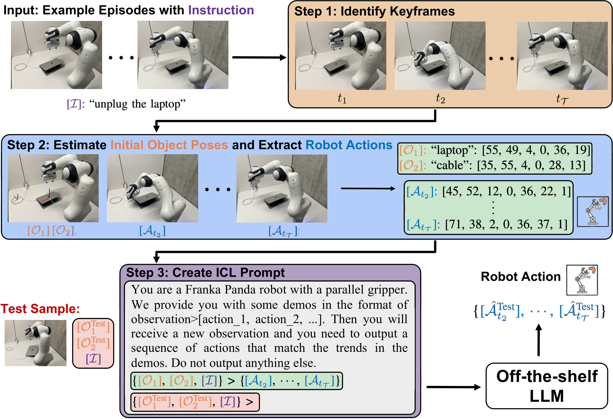

#  RoboPrompt

> [**In-Context Learning Enables Robot Action Prediction in LLMs**](https://arxiv.org/abs/2410.12782)<br>
> [Yida Yin*](https://davidyyd.github.io), [Zekai Wang*](https://zekaiwang04.github.io), [Yuvan Sharma](https://scholar.google.com/citations?hl=en&user=1_IIcds8es4C),[Dantong Niu](https://scholar.google.com/citations?user=AzlUrvUAAAAJ&hl=en), [Trevor Darrell](https://people.eecs.berkeley.edu/~trevor/), [Roei Herzig](https://roeiherz.github.io/)
> <br>University of California, Berkeley<br>
> [[`arXiv`](https://arxiv.org/abs/2410.12782)][[`project page`](https://github.com/davidyyd/roboprompt)]

<p align="center">

</p>

We introduce **RoboPrompt**, a framework that enables an off-the-shelf text-only LLM to directly predict robot actions through in-context learning (ICL) examples without any additional training.

## Installation

Check [INSTALL.md](./INSTALL.md) for detailed instructions. 

## Generating Data

We use the default script from RLBenchto generate data. Replace ``$task``, ``$save_path``, and ``$amount`` in the following command to generate data for your own tasks. You can select tasks as long as they are supported by RLBench. 

You need to generate both training and test data. By default, we use 100 episodes to form the training data and 25 episodes to form the test data.
```bash
cd RLBench/tools/
DISPLAY=:0.0 python dataset_generator.py 
      --tasks=$task \
      --save_path=$save_path \
      --renderer=opengl \
      --episodes_per_task=$amount \
      --processes=1 \
      --variations=1 \
      --all_variations=False
# rename the folder to avoid issues later
mv $save_path/$task/variation0 $save_path/$task/all_variations
```

## Constructing In-Context Demonstrations
Once you have generated the data, you can construct the ICL demonstrations. Please first replace ``ROOT`` in ``form_icl_demonstrations.py`` to the path where you store your ***training data*** and then run the following command to construct the ICL prompts for each of the 18 tasks in our paper. \
By default, we will randomly sample 10 demonstrations to form an ICL prompt each time and form a total of 10 ICL prompts from 100 training episodes of each task.

```bash
python form_icl_demonstrations.py
```

To support more tasks, you can add your own task handler in ``form_icl_demonstrations.py``. You only need to define the mapping ``sim_name_to_real_name`` (e.g., between the simulator name and the real name of the objects you want to specify) in the task and then inherit the ``base_task_handler`` class.

## In-Context Learning

To perform In-Context Learning, you can run the following command. Replace ``$method`` with the task name and ``$test_data_path`` with the path where you store your ***test data***. To turn on the video recorder, you can set ``cinematic_recorder.enabled=True``, and this might slow down the inference speed\
By default, we evaluate RoboPrompt on 25 episodes for each task and allow the agent to take a maximum of 25 steps.
```bash
export OPENAI_API_KEY=$your_api_key # Set your OpenAI API key
DISPLAY=:0.0 python main.py \
      --rlbench.tasks=[$method] \
      --rlbench.task_name=$method \
      --rlbench.episode_length=25 \
      --rlbench.demo_path=$test_data_path \
      --framework.gpu=0 \
      --framework.logdir=$log_dir \
      --framework.eval_episodes=25 \
      --rlbench.headless=True
```
## Acknowledgement

Our code is built on top of [RLBench](https://github.com/stepjam/RLBench) simulation environment and [Peract](https://github.com/peract/peract) codebase.

## Citation
If you find RoboPrompt helpful, please consider citing:
```bibtex
@article{yin2024incontextlearningenablesrobot,
      title={In-Context Learning Enables Robot Action Prediction in LLMs}, 
      author={Yida Yin and Zekai Wang and Yuvan Sharma and Dantong Niu and Trevor Darrell and Roei Herzig},
      year={2024},
      booktitle={arXiv preprint arXiv:2406.11815},
}
```

## Contact
If you have any questions, feel free to contact me through email (davidyinyida0609@berkeley.edu). Enjoy!

